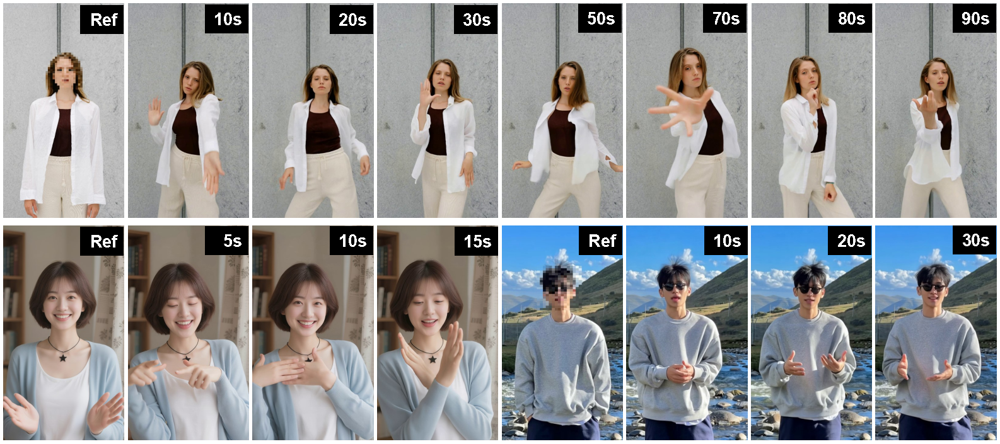

<p align="center">

<h1 align="center">PoseGen: In-Context LoRA Finetuning for Pose-Controllable Long Human Video Generation</h1>
<p align="center">
    <strong>Jingxuan He<sup></sup></strong>
    ·
    <strong>Busheng Su<sup></sup></strong>
    ·
    <strong>Finn Wong<sup>&dagger;</sup></strong>
    <br>
        <a href="https://arxiv.org/abs/2508.05091"></a>
    <br>
</p>


## Introduction
We introduce **PoseGen**, a novel framework that generates arbitrarily long videos of a specific subject from a single reference image and a driving pose sequence.




## Installation

```bash
conda create -n posegen python=3.10 -y
conda activate posegen

conda install pytorch==2.5.1 torchvision==0.20.1 torchaudio==2.5.1 pytorch-cuda=12.4 -c pytorch -c nvidia -y
pip install diffsynth==1.1.7
pip install wan@git+https://github.com/Wan-Video/Wan2.1
pip install -r requirements.txt
```

## Checkpoints
Please prepare checkpoints following the steps below for running inference.

(1) Download [PoseGen checkpoints](https://huggingface.co/Jessie459/PoseGen)

(2) Set the environment variable
```bash
export POSEGEN_CKPT_PATH=path/to/posegen/checkpoints
```

(3) Download [Wan2.1-I2V-14B-720P checkpoints](https://huggingface.co/Wan-AI/Wan2.1-I2V-14B-720P)
```bash
hf download Wan-AI/Wan2.1-I2V-14B-720P Wan2.1_VAE.pth models_t5_umt5-xxl-enc-bf16.pth models_clip_open-clip-xlm-roberta-large-vit-huge-14.pth --local-dir ${POSEGEN_CKPT_PATH}
hf download Wan-AI/Wan2.1-I2V-14B-720P --include google/umt5-xxl/* --local-dir ${POSEGEN_CKPT_PATH}
```

## Inference

To run inference, you need to prepare a reference image and a driving video. Please note that the two subjects in the reference image and the driving video should be approximately aligned in scale and position. Otherwise, the model may fail to generate a consistent background with that in the reference image, which can significantly degrade long video generation quality.

**(1) Extract pose and hand conditions from the driving video**

a. Follow [this guide](./preprocess/README.md) to obtain Sapiens inference results

b. Prepare input videos
```bash
conda activate posegen

python prepare_input_pose.py \
    --pose_path "results/video1/sapiens/pose.pkl" \
    --output_dir "results/video1/inputs" \
    --video_path "examples/video1.mp4"

python prepare_input_hand.py \
    --normal_path "results/video1/sapiens/normal.npy" \
    --seg_path "results/video1/sapiens/seg.npy" \
    --output_dir "results/video1/inputs" \
    --video_path "examples/video1.mp4"
```

**(2) Prepare text prompt**

Download [Qwen/Qwen2.5-VL-7B-Instruct](https://huggingface.co/Qwen/Qwen2.5-VL-7B-Instruct)
```bash
export QWEN25_VL_7B_INSTRUCT_PATH="path/to/Qwen2.5-VL-7B-Instruct"
```

Generate the text prompt of the reference image
```bash
python generate_prompt.py \
    --image_path "examples/image1.png" \
    --output_dir "results/image1" \
    --seed 42
```

**Important**: If the generated prompt does not contain any keywords (i.e., "woman", "girl", "man", "boy"), please manually modify `path/to/prompt.txt`, and then run `python generate_prompt.py --prompt_path path/to/prompt.txt`

**(3) Generate videos**

a. Generate the anchor base chunk (i.e., its background will be transfered to the rest of base chunks):
```bash
MODE="anch"
python inference.py \
    --mode ${MODE} \
    --image_path "examples/image1.png" \
    --prompt_path "results/image1/prompt.txt" \
    --hand_path "results/video1/inputs/hand.mp4" \
    --pose_path "results/video1/inputs/pose.mp4" \
    --output_dir "results/generated" \
    --seed 42 \
    --anch_chunk_idx 0 \
    -s 0 2 \
    -b 34 40 \
    -p "4*10**9"
```

**Tips**:
- If the anchor base chunk contains camera movement that leads to unstable background, you can manually select a base chunk as the anchor by setting `--anch_chunk_idx 0|2|4...` in the above command. `anch_chunk_idx` must be an even number within the bound.
- You can set `-p` or `--num_persistent_param_in_dit` to balance CUDA memory required and the generation speed.
- Due to the inaccuracy of attention-based mask prediction, an excessive background kv-sharing defined by `-s` (denoising steps) and `-b` (transformer blocks) may introduce noticeable artifacts to the generated video. More details can be found in the supplementary S4 of our paper. Practically, we recommend the following settings for your customized inputs:

| Ref Image    | -s    | -b    |
| :---         | :---: | :---: |
| Close-up     | 0 1   | 34 40 |
| Half-body    | 0 2   | 34 40 |
| Full-body    | 0 4   | 32 40 |
| Distant View | 0 4   | 30 40 |

b. Generate the rest of base chunks:
```bash
MODE="base"
python inference.py \
    --mode ${MODE} \
    --image_path "examples/image1.png" \
    --prompt_path "results/image1/prompt.txt" \
    --hand_path "results/video1/inputs/hand.mp4" \
    --pose_path "results/video1/inputs/pose.mp4" \
    --output_dir "results/generated" \
    --seed 42 \
    --anch_chunk_idx 0 \
    -s 0 2 \
    -b 34 40 \
    -p "10**9"
```

c. Generate intermediate video chunks with each conditioning on the previous and next chunks:
```bash
MODE="cond"
python inference.py \
    --mode ${MODE} \
    --image_path "examples/image1.png" \
    --prompt_path "results/image1/prompt.txt" \
    --hand_path "results/video1/inputs/hand.mp4" \
    --pose_path "results/video1/inputs/pose.mp4" \
    --output_dir "results/generated" \
    --seed 42 \
    -p "4*10**9"
```

d. Merge all video chunks into a complete video:
```bash
python merge.py --video_path "examples/video1.mp4" --video_root "results/generated"

# optionally delete cached tensors
rm -r results/generated/attn_maps* results/generated/qkv

# optionally delete video chunks
rm -r results/generated/video-chunk*
```

## Acknowledgement

We are grateful for the following awesome projects: [Sapiens](https://github.com/facebookresearch/sapiens), [Wan2.1](https://github.com/Wan-Video/Wan2.1), and [DiffSynth-Studio](https://github.com/modelscope/DiffSynth-Studio).

## BibTeX

```bibtex
@article{he2025posegen,
  title={PoseGen: In-Context LoRA Finetuning for Pose-Controllable Long Human Video Generation},
  author={He, Jingxuan and Su, Busheng and Wong, Finn},
  journal={arXiv preprint arXiv:2508.05091},
  year={2025}
}